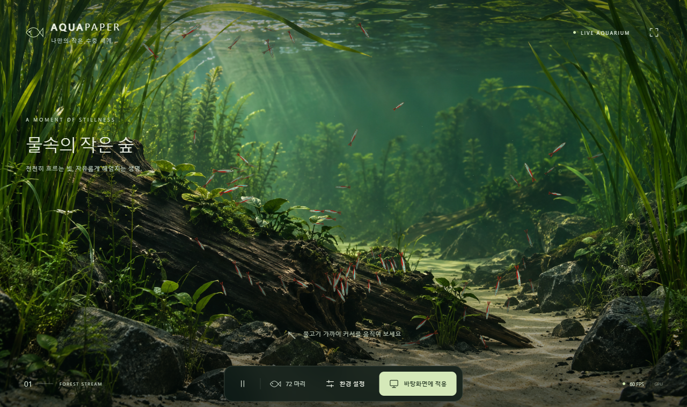
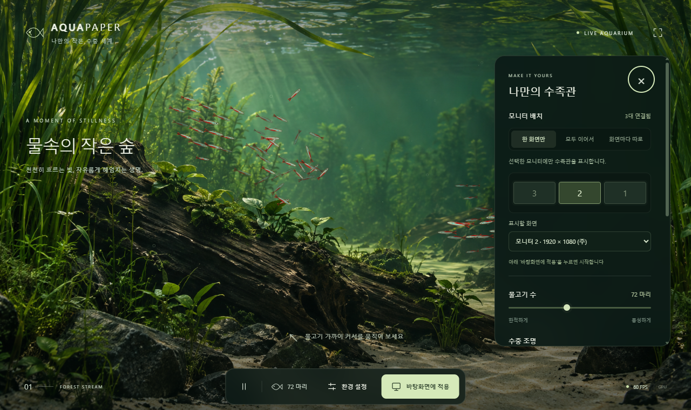

# AquaPaper

**v1.4.0:** 6개 깊이 레이어, 수면·입자 효과와 개별 유영 개선을 포함합니다. [릴리즈 안내](docs/ATMOSPHERE.md)

**v1.3.0:** Windows 자동 시작, 큰 글씨의 카테고리 탭, Blender 러미노즈 테트라·플레코 추가·제거를 포함합니다. [릴리즈 안내](docs/NEXT-VERSION.md) · [플레코의 상세 피부·부착·은신 행동](docs/PLECO.md). 플레코는 전체 바탕화면 합계 최대 8마리입니다.

[한국어](README.ko.md) · [English](README.en.md) · [다운로드 / Releases](https://github.com/Hogrima/AquaPaper/releases/latest)



기본 물고기 표현은 Blender로 제작한 **3D 네온테트라**이며, 기존 모드와 세 가지 모니터 방식을 함께 사용할 수 있습니다. 환경 설정에서 UI 언어를 한국어 또는 English로 고를 수 있고 선택한 설정은 자동으로 저장됩니다. [3D 사용법·원본 모델·행동 근거](docs/3D-BEHAVIOR.md)

## 간편 설치

1. [최신 릴리스](https://github.com/Hogrima/AquaPaper/releases/latest)에서 **AquaPaper-Windows-x64.zip**을 다운로드합니다. `Source code.zip`은 개발용 소스이므로 실행용 ZIP을 선택하세요.
2. ZIP을 **모두 압축 해제**합니다.
3. **Install.cmd**를 더블 클릭합니다. 한국어·영어 안내가 함께 표시되며, 사용자 폴더에 설치하고 바탕화면·시작 메뉴에 바로가기를 만듭니다.
4. 앱의 **환경 설정 → 언어**에서 한국어 또는 English를 고르고, **모니터 배치**에서 표시 방식을 선택한 뒤 **바탕화면에 적용**을 누릅니다.

설치 위치는 `%LOCALAPPDATA%\Programs\AquaPaper`이며 관리자 권한과 .NET 별도 설치는 필요하지 않습니다. **Microsoft Edge WebView2 Runtime**은 필요합니다. 없다면 [Microsoft 공식 페이지](https://developer.microsoft.com/microsoft-edge/webview2/)에서 Evergreen Runtime을 설치하세요. Windows 11 x64에서 검증했습니다.

설치 없이 쓰려면 압축을 푼 폴더에서 **AquaPaper.exe**를 직접 실행하세요. EXE만 다른 폴더로 옮기지 말고 모든 파일을 함께 유지하세요.

업데이트할 때는 트레이 메뉴의 **AquaPaper 종료**로 앱을 종료한 후 새 ZIP의 `Install.cmd`를 실행합니다. 제거하려면 설치 폴더의 **Uninstall.cmd**를 실행하세요. 제거 시 수족관 설정은 유지됩니다. 로그인 시 자동 실행 등록은 하지 않습니다.

[설치 안내만 보기](docs/INSTALL.ko.md)

커서에 반응하는 물고기가 헤엄치는 Windows용 인터랙티브 수족관 월페이퍼입니다. 깊은 초록빛 물, 양옆의 긴 수초, 이끼 낀 고목, 모래와 검은 바위로 이루어진 수중 정원을 보여 줍니다.

## 실행

1. 설치된 바로가기나 압축을 푼 폴더의 `AquaPaper.exe`를 실행합니다.
2. 물고기 가까이 커서를 움직이면 무리가 흩어졌다가 천천히 다시 모입니다.
3. 하단의 **바탕화면에 적용**을 누르면 수족관이 바탕화면 아이콘 뒤에 표시됩니다.
4. 작업 표시줄 알림 영역의 **물고기 아이콘**을 더블 클릭하면 미리보기가 열립니다. 아이콘이 보이지 않으면 알림 영역의 숨겨진 아이콘 메뉴를 확인하세요.
5. 트레이 아이콘을 우클릭하면 환경 설정, 일시정지, 모니터 선택, 바탕화면 해제, 종료를 사용할 수 있습니다.

배포 ZIP은 **전체 압축을 풀고** 실행하세요. `web` 폴더와 DLL 등 실행 폴더의 파일을 함께 유지해야 합니다. 이 배포본에는 .NET 런타임이 포함되어 있습니다. 실행에는 Microsoft Edge WebView2 Runtime이 필요합니다. 현재 PC에서는 설치와 정상 실행을 확인했습니다. 다른 PC에 없다면 [Microsoft 공식 WebView2 배포 페이지](https://developer.microsoft.com/microsoft-edge/webview2/)에서 Evergreen Runtime을 설치하세요.

## 조작과 설정

| 조작 | 기능 |
| --- | --- |
| 마우스 커서 | 가까운 물고기가 커서를 피해 흩어짐 |
| Space | 일시정지 / 재생 |
| F | 전체 화면 / 창 모드 |
| S | 환경 설정 열기 / 닫기 |
| Esc | 설정 닫기 / 전체 화면 종료 |

마우스나 키보드를 조작하지 않으면 미리보기의 안내와 제어 패널이 8.5초 후 사라집니다. 다시 움직이면 표시됩니다. 바탕화면 모드에는 제어 패널이 표시되지 않습니다.

- 물고기: 기본 72마리, 12~160마리 조절
- 물고기 표현: 기본 3D 네온테트라, 기존 모드 선택 가능
- UI 언어: 한국어 / English
- 조명: 자연광 / 노을 / 달빛
- 유영 속도, 커서 반응, 기포·부유물 조절
- 절전: 최대 1280px · 30fps
- 균형: 최대 1920px · 60fps
- 선명: 최대 2560px · 60fps

프레임 수는 목표 상한이며 그래픽 장치와 전원 상태에 따라 달라집니다. 창 최소화, 화면 잠금, 시스템 절전, 해당 모니터의 전체 화면 앱 실행 중에는 관련 렌더링을 멈춥니다. 바탕화면에서 다른 앱 위에 있는 커서에는 반응하지 않습니다.

## 멀티 모니터 (v1.2)



**환경 설정 → 모니터 배치**에서 세 가지 표시 방식을 선택할 수 있습니다. 설정 상단에 Windows에 연결된 실제 모니터의 위치·크기를 보여 주는 배치도가 표시됩니다. 트레이의 **모니터 배치** 메뉴에서도 같은 옵션을 사용할 수 있습니다.

| 방식 | 동작 |
| --- | --- |
| **한 화면만** | 선택한 모니터에만 표시합니다. 배치도의 모니터 번호나 아래 목록으로 대상 화면을 고릅니다. |
| **모두 이어서** | Windows 디스플레이 배치 전체를 하나의 넓은 수족관으로 연결합니다. 물고기와 커서 반응이 모니터 경계를 넘어 이어집니다. 물고기 수는 전체 수족관 기준입니다. |
| **화면마다 따로** | 연결된 모든 모니터에 각각 독립된 수족관을 표시합니다. 조명·속도 등 설정은 공통이며, 물고기 수는 화면마다 적용됩니다. |

처음에는 표시 방식을 고른 뒤 **바탕화면에 적용**을 누르세요. 이미 적용한 상태에서는 배치 변경이 즉시 반영됩니다. 선택한 방식과 모니터는 앱을 종료해도 저장됩니다. **모두 이어서**는 하나의 캔버스를 사용하며, **화면마다 따로**는 모니터마다 창과 캔버스를 하나씩 사용합니다.

음수 좌표, 세로로 배치한 모니터, 해상도와 Windows 배율이 서로 다른 모니터를 처리합니다. 모니터 번호는 Windows 디스플레이 장치 번호를 사용합니다. 물리적인 화면 순서는 Windows 디스플레이 설정에 맞춰 주세요. 연결 모드의 배경은 전체 화면 비율에 맞춰 확대되어 이미지 위아래가 일부 잘릴 수 있습니다. 화면 높이가 다르거나 빈 공간이 있는 배치는 그 영역도 가상 수족관에 포함되므로 물고기가 잠시 보이지 않는 영역을 통과할 수 있습니다.

모니터 연결·해제나 해상도 변경 시 현재 방식을 유지하며 자동으로 재배치합니다. 선택한 모니터가 빠지면 임시로 주 모니터를 사용하고, 다시 연결되면 선택한 화면으로 돌아갑니다. Explorer가 재시작되어 바탕화면 연결이 사라지면 미리보기로 복구합니다.

개별 모드에서는 전체 화면 앱이 덮은 모니터만 자동으로 멈춥니다. 연결 모드에서는 전체 수족관을 덮는 경우에만 멈춰 다른 화면의 움직임을 유지합니다. 절전·균형·선명 품질은 화면 수에 맞춰 해상도 예산을 늘리되 GPU 한도를 넘지 않게 제한합니다. 예를 들어 1920 × 1080 모니터 3대를 가로로 연결하면 균형 모드에서 5760 × 1080으로 렌더링합니다. 여러 화면을 사용하면 GPU 부하가 증가하므로 필요하면 절전 모드를 선택하세요.

## 데이터와 종료

- 설정: `%LOCALAPPDATA%/AquaPaper/settings.json`
- 모니터 배치: `%LOCALAPPDATA%/AquaPaper/display-settings.json`
- 오류 로그: `%LOCALAPPDATA%/AquaPaper/app.log`
- WebView2 캐시: `%LOCALAPPDATA%/AquaPaper/WebView2/`
- 바탕화면 적용 중 미리보기 창을 닫으면 트레이에서 계속 실행됩니다.
- 완전히 종료하려면 트레이의 **AquaPaper 종료**를 누릅니다. 기존 Windows 배경이 다시 보입니다.
- 관리자 권한이 필요하지 않습니다. 자동 시작 등록이나 기존 배경 이미지 변경을 하지 않습니다.
- 실행에 외부 서버, 계정, API 키가 필요하지 않으며 앱 콘텐츠는 로컬에서 읽습니다.

## 구현

네이티브 호스트는 **C# / .NET 10 / Windows Forms / WebView2**, 그래픽은 **WebGL 2 / GLSL 셰이더**입니다. 수조 배경은 사실적인 이미지에 수중 왜곡·빛·입자를 합성한 **2.5D 방식**입니다. 기본은 Blender에서 제작한 **3D 물고기 메시**이며 기존 셰이더 모드도 설정에서 선택할 수 있습니다. 수조 전체를 모델링한 3D 장면이나 영상 루프는 아닙니다.

물고기는 매 프레임 군집 응집, 이웃 방향 정렬, 충돌 회피, 커서로부터의 도피, 경계 회피를 계산합니다. 물고기 렌더링은 GPU instancing을 사용합니다. CPU의 이웃 계산은 O(n²)이며 최대 160마리로 제한했습니다. 배경·물고기·입자를 기존 모드에서는 최대 3회, 3D 모드에서는 불투명 몸체와 투명 지느러미를 나누어 최대 4회의 draw call로 그립니다.

바탕화면 연결은 Win32 `WorkerW` / `Progman` 레이어를 사용하며 Windows 11의 raised desktop 경로도 지원합니다. 이 셸 연결 방식은 Windows 업데이트나 타사 바탕화면 프로그램에 영향을 받을 수 있습니다. 연결 실패 시 미리보기와 오류 안내를 제공합니다. 외부 동적 월페이퍼 앱과 같은 모니터에 동시에 적용하는 것은 피하세요.

### 소스 구조

| 파일 | 역할 |
| --- | --- |
| `Program.cs`, `AquariumApp.cs` | 앱 수명, 트레이, 설정, 전원·모니터 이벤트 |
| `WallpaperLayout.cs` | 단일·연결·개별 화면 계획과 물리 좌표 변환 |
| `NativeMethods.cs` | 바탕화면 연결, 전역 커서 좌표, 전체 화면 감지 |
| `AquariumWindow.cs` | WebView2 호스트, 네이티브 메시지 연결 |
| `web/simulation.js` | 군집 행동과 커서 회피 |
| `web/renderer.js` | WebGL 렌더링과 GLSL 셰이더 |
| `web/app.js`, `web/i18n.js` | 설정 화면, 한·영 전환, 프레임 제한, 메시지 처리 |
| `web/display.js` | 모니터 배치도와 다중 화면 해상도 예산 |
| `web/assets/aquarium.png` | 생성한 수중 배경 이미지 |
| `installer/Install.ps1` | 사용자별 설치·업데이트·제거, 한영 안내 |

### 개발 및 빌드

.NET 10 SDK, Node.js 20 이상(테스트·웹 미리보기용).

```powershell
dotnet restore
dotnet run
node --test tests/*.test.mjs
dotnet run --project tests/LayoutTests
node scripts/preview.mjs
```

웹 미리보기 주소는 `http://127.0.0.1:4173`입니다. 브라우저에서는 화면과 인터랙션을 테스트할 수 있고, Windows 바탕화면 연결은 네이티브 실행본에서 동작합니다.

```powershell
# .NET 런타임 포함 배포본과 ZIP
.\build.ps1 -Portable -Zip

# 설치·업데이트·제거 검사 (실제 바로가기는 만들지 않음)
powershell -NoProfile -ExecutionPolicy Bypass -File tests/installer.test.ps1

# 설치된 .NET 10을 이용하는 작은 배포본: dist/framework-dependent/AquaPaper
.\build.ps1

# 시작과 동시에 바탕화면에 적용
.\dist\AquaPaper\AquaPaper.exe --wallpaper

# 네이티브 통합 검사: 잠시 바탕화면 적용 후 원복하고 종료
.\dist\AquaPaper\AquaPaper.exe --smoke-test --output=C:\Codex\AquaPaper\artifacts

# 모든 모니터의 단일 선택, 전체 연결, 개별 표시, 빠른 전환을 실제 검사
.\dist\AquaPaper\AquaPaper.exe --multi-smoke-test --output=C:\Codex\AquaPaper\artifacts\multi-monitor
node scripts/verify-smoke.mjs artifacts/multi-monitor/smoke-test.json
```

통합 검사는 실제 WebView2에서 셰이더 컴파일·프레임률·일시정지·바탕화면 부모 연결·미리보기 복귀를 확인하고 JSON과 PNG를 저장합니다. 다중 화면 검사는 실제 창의 위치·크기가 목표 모니터와 일치하는지, 커서 좌표가 적절한 화면으로 전달되는지, 빠른 전환의 마지막 선택이 적용되는지, 종료 후 창이 남지 않는지도 검사합니다. 검사 모드에서는 모니터 선택을 저장하지 않습니다. 이미 실행 중인 AquaPaper는 먼저 종료해야 합니다. Node 테스트는 물고기 회피·안정성 및 다중 화면 렌더링 예산을, C# 테스트는 음수 좌표·연결 해제·경계 연속성을 검증합니다.

## 배경 제작

`web/assets/aquarium.png`는 내장 **imagegen** 도구로 이 프로젝트를 위해 생성했습니다. 사용한 최종 프롬프트는 `docs/image-prompt.md`에 보관했습니다. 물고기는 배경에 포함되어 있지 않으며 모두 코드로 렌더링됩니다.

## 참고 문서

- [Microsoft: WebView2 로컬 콘텐츠](https://learn.microsoft.com/microsoft-edge/webview2/concepts/working-with-local-content)
- [Microsoft: SetParent의 스타일·DPI 제약](https://learn.microsoft.com/windows/win32/api/winuser/nf-winuser-setparent)
- [Microsoft: WebView2 기능 플래그](https://learn.microsoft.com/microsoft-edge/webview2/concepts/webview-features-flags)
