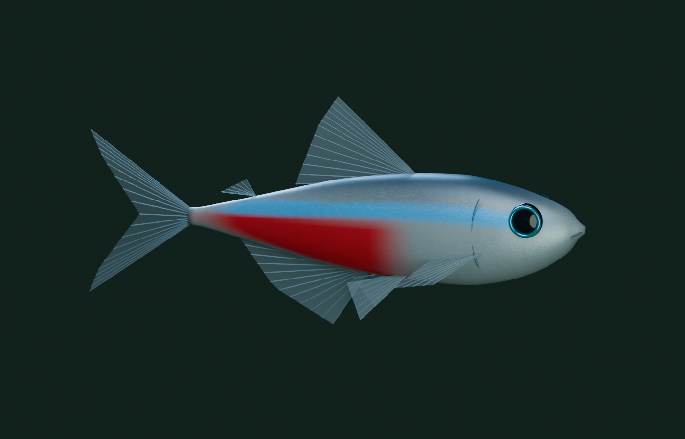

# 3D 네온테트라 / 3D neon tetra

## 로컬에서 사용하기

기본값은 **환경 설정 → 물고기 표현 → 3D 네온테트라**입니다. **기존 모드**도 그대로 선택할 수 있습니다. 선택은 `settings.json`의 `fishMode`에 저장되고 모든 수족관 창에 전달됩니다. 설정에서 UI 언어도 한국어/English로 바꿀 수 있으며 단일·연결·개별 모니터 옵션을 함께 사용할 수 있습니다.

AquaPaper v1.2.0 릴리스에 3D 모드가 포함됩니다. Blender는 모델을 다시 만들 때만 필요하고 앱 실행에는 필요하지 않습니다.

```powershell
dotnet run -- --settings

# 기본 시뮬레이션, 배치, 3D 행동 및 Blender 모델 검증
node --test tests/*.test.mjs

# 실제 바탕화면을 잠시 사용하고 원복하는 통합 검사
dotnet build AquaPaper.csproj -c Release -r win-x64 -p:RuntimeFrameworkVersion=10.0.12
.\bin\Release\net10.0-windows\win-x64\AquaPaper.exe --multi-smoke-test --output=C:\Codex\AquaPaper\artifacts\tetra-native-final
node scripts/verify-smoke.mjs artifacts/tetra-native-final/smoke-test.json
```

검사 전 다른 AquaPaper 인스턴스를 종료하세요. 네이티브 검사에서는 모니터·물고기 설정 파일을 저장하지 않습니다. Blender는 모델을 재제작할 때만 필요하고 앱 실행에는 필요하지 않습니다.

## 모델과 렌더링



Blender에서 몸체의 입체 단면, 양쪽 눈과 홍채, 아가미, 입, 등·꼬리·뒷·가슴·배·기름지느러미를 제작했습니다. 은빛 배, 푸른 측면 띠, 몸 뒤쪽의 붉은 띠를 분리했습니다. 지느러미는 반투명 막과 지느러미 줄기로 구성됩니다.

| 파일 | 용도 |
| --- | --- |
| `scripts/build-neon-tetra.py` | Blender 모델·렌더·내보내기 재현 스크립트 |
| `assets-source/neon-tetra.blend` | 재질·조명·카메라와 24프레임 꼬리 시연을 포함한 편집 원본 |
| `web/assets/neon-tetra/neon-tetra.glb` | 다른 3D 도구에서 열 수 있는 정적 GLB |
| `neon-tetra.mesh.bin`, `neon-tetra.lod.bin` | Blender에서 내보낸 실시간용 전체/경량 메시 |
| `neon-tetra.mesh.json` | 정점 수·좌표계·표면 구간 메타데이터 |
| `web/fish3d.js` | 원근 투영, 깊이 버퍼, 지느러미 투명도, 반사 및 GPU 몸체 변형 |
| `web/simulation3d.js` | 입체 위치·속도·군집·커서 회피 계산 |

정점 하나는 little-endian float32 11개로 구성됩니다: 위치 XYZ, 법선 XYZ, 선형 RGBA, 표면 종류(0 몸체 / 1 지느러미 / 2 눈). 불투명 정점 다음에 투명 정점이 옵니다. 전체 메시 **9,778삼각형**, 경량 메시 **3,784삼각형**을 인스턴싱합니다. **균형·절전은 경량 메시**, **선명은 전체 메시**를 사용합니다. 3D 물고기의 몸과 꼬리는 매 프레임 변형되며, 다른 물고기와의 앞뒤 관계는 깊이 버퍼로 처리됩니다. 수초·고목·바닥은 기존 2.5D 배경입니다.

```powershell
& 'C:\Program Files\Blender Foundation\Blender 5.2\blender.exe' --background --threads 6 --python-exit-code 1 --python scripts/build-neon-tetra.py
```

Blender 5.2.2 LTS에서 재현했습니다. 경로는 설치 위치에 맞게 바꾸세요. 렌더 결과는 `artifacts/tetra/blender-neon-tetra.png`에 저장됩니다.

## 생태적 근거와 구현상의 선택

네온테트라 연구에서는 무리를 유지하려는 행동, 짧은 추진과 활주의 반복, 개체 간 거리 유지가 관찰되었습니다. 이 세 가지를 행동 설계의 근거로 삼았습니다. [Larrieu et al., Scientific Reports, 2023](https://www.nature.com/articles/s41598-023-36869-9)

근연종인 러미노즈 테트라 연구는 일부 이웃을 선택적으로 인식하는 것과 인력·방향 정렬의 강도가 군집 형태에 영향을 준다는 점을 보여 줍니다. 이는 국소 상호작용 설계의 참고이며 네온테트라의 수치를 직접 측정한 자료로 취급하지 않습니다. [Wang et al., PLOS Computational Biology, 2022](https://doi.org/10.1371/journal.pcbi.1009437)

이 앱의 **이웃 수·시야·주기·속도·깊이·놀람 전파 계수는 시각화를 위한 조정값**입니다. 실측 궤적에 맞춘 예측 모델이나 유체역학 시뮬레이터는 아닙니다.

| 구현한 행동 | 앱의 계산 방식 |
| --- | --- |
| 가속 후 활주 | 개체별로 서로 다른 0.52–0.84초 주기. 추진은 0.15–0.22초, 활주 중에는 항력으로 감속. 속도 설정에 따라 주기가 변함 |
| 국소 군집 | 약 300도 시야 안의 가까운 이웃 최대 6마리. 응집·방향 정렬, 가까운 거리의 전방위 반발 |
| 자유로운 합류 | 영구적인 무리 번호나 대장을 두지 않음. 고립되면 가까운 개체를 찾아 접근 |
| 입체 유영 | XYZ 속도, 제한된 회전 속도, 완만한 상하 이동. 몸의 곡률과 작은 기울기가 회전에 반응 |
| 실제 추진에 맞춘 꼬리 | 추진 때 진폭·주파수 증가, 활주 때 감소. 모든 개체의 꼬리가 같은 위상으로 움직이지 않음 |
| 커서에 놀람 | 원근 투영된 위치에서 감지. 방향 전환·가속·깊이 방향 회피, 가까운 이웃에게 감쇠된 반응 전달 |
| 회복 | 자극이 사라지면 놀람이 감쇠하고 국소 군집 규칙으로 복귀 |
| 유리·수면·바닥 회피 | 진행 방향을 미리 보며 수조 경계 안쪽으로 회전. 고목·수초의 3D 충돌 판정은 없음 |

## English

The default is **Settings → Fish appearance → 3D neon tetra** (`환경 설정 → 물고기 표현 → 3D 네온테트라`). The Classic mode can be selected at any time. The preference and Korean/English language choice persist across sessions and apply to all aquarium windows. All three monitor layouts remain available in v1.2.0.

The fish is an original Blender mesh with a volumetric body, bilateral eyes, gills, mouth and translucent fins. The application uses that mesh directly, with perspective, depth testing, view-dependent blue reflectance and live body/fin deformation. The aquarium scenery remains a 2.5D background. Blender is needed only to rebuild the assets, not to run the app. Balanced/Eco use 3,784 triangles per fish; High uses 9,778. The editable `.blend`, static `.glb`, runtime mesh and generation script are included.

The neon-tetra paper above informs three qualitative behaviors: shoaling, burst-and-coast locomotion and spacing. The rummy-nose-tetra paper informs selective local interactions, without treating another species' measurements as neon-tetra constants. The six-neighbor limit, view angle, timing, turning limits, depth and alarm transfer are explicitly chosen visualization parameters. This is a behavior-inspired animation, not a calibrated biological predictor.

Individuals alternate thrust and deceleration asynchronously, align with nearby visible fish, repel close neighbors, seek company when isolated and move through a bounded volume. Steering affects body bend and slight bank; thrust affects tail amplitude and frequency. Cursor avoidance uses projected screen position at each fish's depth, triggers a turn/burst/dive, then decays so local schooling can resume. There is no permanent leader or scripted school waypoint.

The commands above run behavior/asset tests and native multi-monitor integration tests. Native tests temporarily use the desktop and then restore it; monitor/fish configuration files are not saved in test mode. Validation results are recorded in [3D-VERIFICATION.md](3D-VERIFICATION.md).
