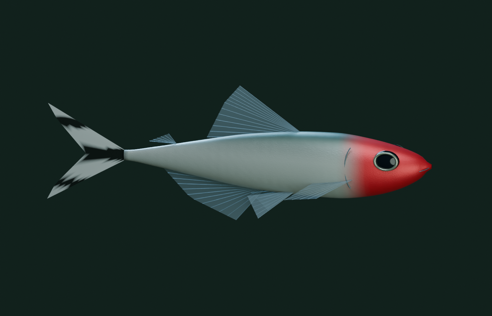

# AquaPaper v1.3.0 릴리즈 안내 / Release guide

v1.3.0에 포함된 Windows 자동 시작, 새 설정 화면과 어종 기능의 사용 방법과 검증 결과입니다.

This guide covers the Windows startup, redesigned settings and species features included in AquaPaper v1.3.0.

## 사용 방법

- **환경 설정 → 일반 → Windows 시작 시 자동 적용**을 켜면 다음 Windows 로그인부터 저장된 설정으로 바탕화면에 적용합니다. 처음에는 꺼져 있으며, 켜거나 끈 상태는 Windows에 즉시 저장됩니다. 미리보기 창은 열지 않습니다.
- **물고기 / 수조 / 화면 / 일반** 탭으로 설정을 나누었습니다. 제목·탭은 고정되고 선택한 카테고리만 스크롤합니다. 주요 글씨는 16px, 설명은 14px이며 탭은 방향키·Home·End로도 이동할 수 있습니다.
- **물고기 → 3D 물고기 → 러미노즈 테트라 → 추가**로 새 무리를 넣습니다. 각 어종의 마릿수를 조절하거나 **제거**할 수 있습니다. 마지막 군영 어종의 제거는 막고 각 무리는 최소 6마리, 군영 어종 합계는 12~160마리를 유지합니다. 군영 어종 수 슬라이더는 현재 어종 비율을 유지합니다.
- **비파 · 플레코 → 추가**로 바닥 생활 어종을 별도로 넣습니다. **전체 바탕화면 합계 최대 8마리**이며, 3개 화면에 따로 배치하면 3/3/2마리로 나눕니다. 상세 피부 재질, 20~28cm 크기 표현, 유리 부착·휴식·은신은 [플레코 안내](PLECO.md)를 참고하세요.
- 기존 저장 파일은 기존 마릿수의 네온테트라로 그대로 열립니다. 새 어종은 직접 추가할 때만 들어갑니다. 기존 모드에서는 기존 표현을 유지하며 3D 어종 구성은 저장됩니다.
- 단일·연결·개별 모니터 배치, 언어, 어종 구성, 조명, 속도와 품질은 자동 저장됩니다. **화면마다 따로**에서는 군영 어종 수가 각 수조에 적용되고, 플레코는 전체 수를 나눕니다.

자동 시작은 현재 사용자 `HKCU\Software\Microsoft\Windows\CurrentVersion\Run`의 `AquaPaper` 값에 `"실행 파일 경로" --startup --wallpaper`를 등록합니다. 관리자 권한은 필요 없습니다. 일반 탭에서 해제할 수 있습니다. Windows 작업 관리자에서 시작 앱을 사용 안 함으로 지정한 경우 앱에 안내가 표시됩니다. 포터블 폴더를 옮기면 옵션을 껐다 켜서 경로를 갱신하세요. 제거 프로그램은 해당 설치 경로에 등록된 항목만 지웁니다. 설정 초기화는 수족관 설정에만 적용되며 자동 시작 및 모니터 배치는 유지합니다.

로그인 직후 탐색기가 아직 준비되지 않았을 때 최대 6회 재시도합니다. 모두 실패하면 환경설정을 엽니다. 이미 실행 중일 때 자동 시작이 중복 호출되면 조용히 종료합니다.

## Usage

- Enable **Settings → General → Apply at Windows startup** to restore the saved aquarium at your next Windows sign-in, without opening a preview. Startup is initially off; changing it immediately updates the per-user Windows registration.
- Settings are grouped into **Fish / Aquarium / Displays / General**. The header and tabs stay visible; only the selected category scrolls. Main labels use 16px text and descriptions use 14px. Arrow keys, Home and End navigate the tabs.
- In **Fish → 3D fish**, select **Add** beside **Rummy-nose tetra**. Adjust each school size or remove a species. The last schooling species cannot be removed. Each school has at least 6 fish, with 12–160 schooling fish in total. The schooling-fish slider preserves the species ratio.
- Select **Sailfin pleco → Add** for the independent bottom-dwelling population, capped at **eight across the desktop** (3/3/2 across three separate aquariums). See the [pleco guide](PLECO.md) for detailed skin, 20–28 cm scale, attachment, resting and hiding behavior.
- Old saves keep their original neon-tetra population. The new species is opt-in. Classic mode remains available and remembers the 3D species selection for when you switch back.
- Monitor layout, language, species counts, lighting, speed and quality are saved automatically. Separate-display mode applies schooling counts to each aquarium and divides the total pleco count across them.

Startup uses the current user's Windows Run registry key, requires no administrator access, and can be disabled in General. Windows Task Manager can independently disable a startup app; AquaPaper reports that state. If you move a portable folder, toggle the option off/on to update the executable path. Uninstall removes only the registration pointing to that installed copy. Reset restores aquarium settings but leaves startup registration and monitor layout unchanged. At sign-in the app retries desktop attachment up to six times if Explorer is not ready; duplicate startup launches exit quietly.

## 새 어종 / New species



러미노즈 테트라 **Petitella bleheri**(구명 *Hemigrammus bleheri*)를 Blender에서 직접 제작했습니다. 붉은 머리, 은빛 몸통, 흑백 꼬리와 반투명 지느러미를 갖추며, 네온테트라보다 조금 긴 체형으로 표현했습니다. 원본은 `assets-source/rummy-nose.blend`, 실행용 메시와 GLB는 `web/assets/rummy-nose/`에 있습니다. 앱 실행에는 Blender가 필요 없습니다.

The original Blender model represents **Petitella bleheri**, formerly *Hemigrammus bleheri*: red head, silver body, black-and-white forked tail, translucent fins and a more elongated body than the neon tetra. The editable source is `assets-source/rummy-nose.blend`; runtime meshes and GLB are in `web/assets/rummy-nose/`. Blender is only required to regenerate the asset.

이 종은 네그루강 유역에서 연구된 아마존 어종입니다([현장 연구](https://institutodepesca.org/index.php/bip/article/view/1196)). 네온테트라는 우카얄리–솔리몽이스·푸루스강의 흑수·청수 하천에 분포합니다([분류·분포 연구](https://doi.org/10.1590/1982-0224-2019-0109)). 비슷한 아마존 담수 환경의 조합이며, 같은 지점에 반드시 공존한다는 재현은 아닙니다.

This is a combination of fish from similar Amazonian freshwater environments, not a claim that they share every locality. The field and taxonomic studies above support the habitat context and species naming.

군집은 같은 종의 가까운 이웃을 따라 방향·간격을 맞추며, 충돌 회피는 두 종 모두를 대상으로 합니다. 러미노즈는 조금 더 강하게 정렬·응집하도록 조정했습니다. 가속/활주, 꼬리 운동, 입체 회전과 커서 회피는 실시간 계산입니다. 이 계수들은 시각적·행동적 설계값이며 *P. bleheri* 실측 데이터에 맞춘 예측 모델은 아닙니다. 기존 [행동 모델 근거](3D-BEHAVIOR.md)를 함께 참고하세요.

Schooling follows nearby conspecifics; collision avoidance includes both species. Rummy-nose alignment and cohesion are modestly stronger. Burst-and-coast swimming, tail deformation, 3D turns and cursor escape run live. These are behavior-inspired visual parameters, not a biological prediction fitted to *P. bleheri* measurements. Bodies are depth-tested before a globally depth-sorted transparent-fin pass across both species. Full and lightweight meshes remain available.

## 개발·검증 / Development and checks

```powershell
# Generate only the new fish; existing neon assets remain untouched.
& 'C:\Program Files\Blender Foundation\Blender 5.2\blender.exe' --background --threads 6 --python-exit-code 1 --python scripts/build-neon-tetra.py -- --rummy-nose
node --test tests/*.test.mjs
dotnet build AquaPaper.csproj -c Release -r win-x64 --no-restore -p:RuntimeFrameworkVersion=10.0.12

# Close any running AquaPaper instance before native integration checks.
.\bin\Release\net10.0-windows\win-x64\AquaPaper.exe --startup --wallpaper --startup-smoke-test --output=C:\Codex\AquaPaper\artifacts\startup-final
.\bin\Release\net10.0-windows\win-x64\AquaPaper.exe --multi-smoke-test --mixed-species --output=C:\Codex\AquaPaper\artifacts\mixed-species-native
node scripts/verify-smoke.mjs artifacts/mixed-species-native/smoke-test.json
```

네이티브 검사는 바탕화면을 잠시 사용한 후 종료합니다. 사용자의 설정 파일과 실제 자동 시작 등록은 수정하지 않습니다. 자동 시작 등록 검사는 별도 임시 레지스트리 키를 사용하고 정리합니다. `--startup-smoke-test`는 실제 저장 설정으로 창 없는 실행 경로를 검증하며, Windows 재부팅 자체를 수행하는 검사는 아닙니다.

Native tests temporarily use the desktop and then exit. They do not write user preference files or the real startup registration. Registry round-trip testing uses an isolated temporary key and removes it afterward. The startup test exercises the actual saved-settings launch path, without rebooting Windows.

## 테스트 결과 / Test results · 2026-09-19

- Windows Release 빌드: 경고·오류 0 / Release build: zero warnings or errors.
- JavaScript 29개 검사, 모니터 배치 16개 단언, 설치·업데이트·제거 23개 검사 통과 / 29 JavaScript tests, 16 layout assertions, 23 installer checks passed.
- 저장된 설정으로 `--startup` 실행: 미리보기 없이 DISPLAY1에 적용, 설정 복원·이후 설정 창 열기·적용 해제·레지스트리 등록/해제 격리 검사 통과 / Startup restored the saved DISPLAY1 layout and settings without a preview; isolated registry round-trip passed.
- 실제 1920×1080 모니터 3대, 네온 48 + 러미노즈 24: 단일 60fps, 연결 56fps, 개별 57/58/58fps / Three physical displays, 48 neon + 24 rummy-nose: single 60fps, span 56fps, separate 57/58/58fps.
- 미리보기 160마리: 선명 60fps, 절전 30fps. 모든 검사에서 JS/WebGL 오류 없음 / 160-fish preview: High 60fps, Eco 30fps; no JS/WebGL errors.
- 브라우저에서 추가·제거, 한 종만 남기기, 새로고침 후 구성 복원, 한·영 전환, 방향키 탭 이동, 650×460 창의 레이아웃을 확인 / Browser checks covered species controls, single-species mode, reload persistence, both languages, keyboard tabs and a 650×460 viewport.

수치는 이 PC에서 짧은 구간을 측정한 결과이며 하드웨어와 모니터 구성에 따라 달라집니다. 장시간 안정성·실제 재부팅·로그인 지연 상황은 별도 검증 대상입니다.

These are short samples on this PC, not performance guarantees. Long-duration operation, an actual reboot/sign-in, and delayed-shell startup remain separate validation scenarios.

## 플레코 추가 검증 / Pleco checks · 2026-09-20

- Blender 모델·흡착 입·지느러미·은신처·경량 메시를 생성하고 스튜디오 렌더와 실제 Windows 렌더를 확인 / Generated and inspected Blender models, oral disc, fins, refuges, LOD and native rendering.
- JavaScript **37개 검사**, 모니터 배치·전체 플레코 수 배분 **297개 단언** 통과. Release 빌드 경고·오류 0 / **37 JS tests**, **297 layout/allocation assertions**, zero-warning Release build.
- 브라우저에서 99 입력 → 8 제한, 제거 → 0, 재추가, 2마리 저장 후 새로고침 복원 확인 / Browser UI verified 99 → 8 clamp, removal to zero, re-add and persistence of two plecos across reload.
- 한·영 플레코 설정을 확인하고, 하단 입력란 포커스로 바깥 패널까지 스크롤되던 문제를 수정했습니다. 제목·탭은 고정되고 내용만 스크롤합니다 / Verified both UI languages and fixed focus-induced outer-panel scrolling; the header and tabs remain fixed.
- 실제 1080p 모니터 3대에서 단일·연결·개별 배치, 빠른 모드 전환, 적용·해제, 일시정지, 3D/기존 모드 전환과 커서 회피 통과. JS/WebGL 오류 없음 / Three-display native checks passed attachment, layout changes, pause/resume, mode switching and cursor escape with no JS/WebGL errors.
- **네온 48 + 러미노즈 24 + 플레코 8**, 균형 품질: 단일 모니터별 60fps, 5760×1080 연결 39fps, 개별 수조 36/37/37fps. 플레코 배분은 8 / 8 / 3·3·2 / **48 neon + 24 rummy-nose + 8 plecos**, Balanced: 60fps per single-display case, 39fps span, 36/37/37fps separate; plecos correctly allocated 8 / 8 / 3·3·2.
- 군영 160 + 플레코 8 미리보기: 선명 42fps, 절전 30fps / 160 schooling fish + 8 plecos preview: High 42fps, Eco 30fps.

최대 개체 수의 상세 재질은 GPU 비용이 크며, 이 구성에서는 모든 배치에서 60fps를 달성하지 못했습니다. 위 수치는 짧은 측정값입니다. 보고서: `artifacts/pleco-texture-final/smoke-test.json`.

The detailed materials at maximum population have a substantial GPU cost; this configuration does not sustain 60fps in every layout. These are short samples. Report: `artifacts/pleco-texture-final/smoke-test.json`.
