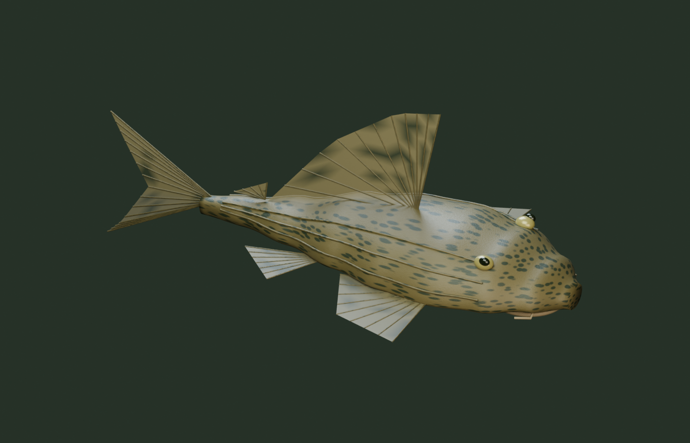
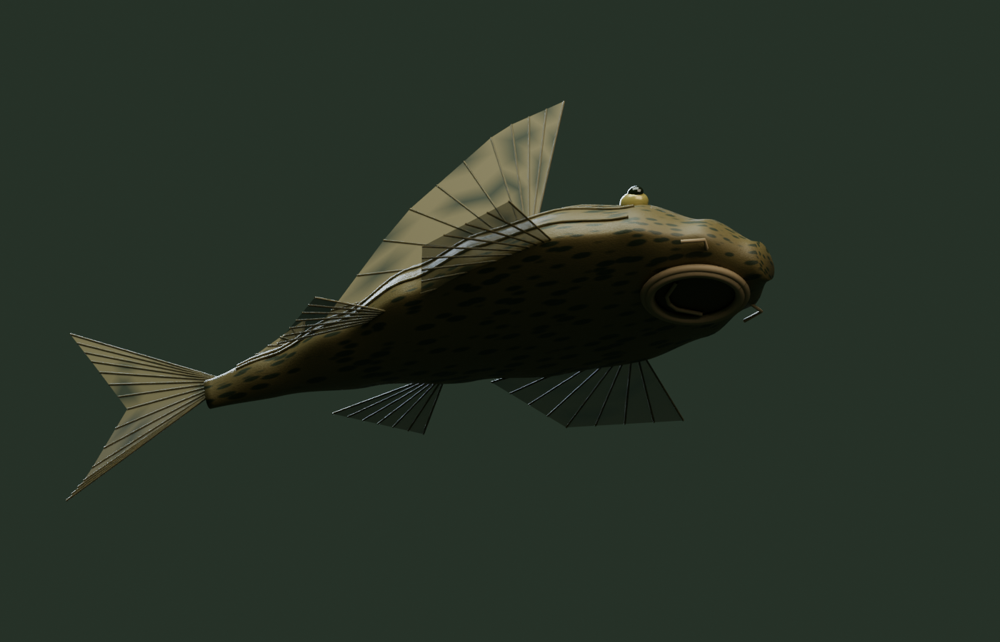

# 비파 / Sailfin pleco — 어종 안내 / Species guide

## 사용 방법

**환경 설정 → 물고기 → 3D 물고기 → 비파 · 플레코 → 추가**로 넣습니다. 수량은 **1~8마리**이며, **제거**하면 0마리가 됩니다. 마릿수는 자동 저장되고 Windows 자동 시작에서도 복원됩니다. 기존 모드에서는 플레코를 표시하지 않으며, 3D로 돌아오면 저장된 구성이 복원됩니다.

제한은 **전체 바탕화면 합계 8마리**입니다. 단일 모니터와 연결 모드에는 지정한 수를 배치합니다. 화면마다 따로 모드에서는 균등하게 나눕니다. 예를 들어 3개 모니터에 8마리를 설정하면 **3 / 3 / 2**마리입니다. 군영 어종의 12~160마리 설정과 독립적이며, 네온·러미노즈 수는 바뀌지 않습니다. 구버전 저장 파일에는 기본적으로 플레코가 추가되지 않습니다.

## 형상과 피부



**Pterygoplichthys pardalis**를 참고한 자체 제작 Blender 모델입니다. 넓고 납작한 머리, 긴 꼬리자루, 골판 능선, 큰 등지느러미, 지느러미 줄기, 짧은 수염, 배 쪽 흡착 입과 입술을 실제 메시로 만들었습니다.

실행 화면에서는 저해상도 이미지 확대 대신 **개체 좌표 기반 절차적 피부 재질**을 계산합니다. 불규칙한 반점, 골판 경계, 미세 입자, 배의 잔주름과 입술의 방사형 주름을 색·거칠기·표면 법선에 반영합니다. 화면 미분 기반 필터링으로 멀리 있는 무늬의 깜박임을 줄입니다. Blender 원본에도 편집 가능한 절차적 반점·요철 재질이 있습니다. Blender 스튜디오 렌더와 수족관 셰이더는 서로 다른 조명과 재질 구현을 사용하므로 결과가 완전히 같지는 않습니다.

- 편집 원본: `assets-source/pleco.blend` — 24프레임 꼬리 변형 예시와 은신처 포함
- 실행용: `web/assets/pleco/` — 플레코·속이 빈 유목 은신처의 메시, 경량 메시, GLB
- 생성기: `scripts/build-pleco.py` — Blender 5.2.2 LTS에서 생성·렌더링 검증
- 앱 실행에는 Blender가 필요하지 않습니다. 앱의 움직임은 녹화 영상이 아닌 실시간 계산입니다.

## 크기와 행동



화면에는 **20~28cm의 성장 중인 개체**를 표현합니다. 수조 높이를 55cm로 두고 테트라와 동일한 길이 단위를 사용하므로 테트라보다 훨씬 크게 보입니다. 이는 성어 최대 크기를 줄여 표기한 값이 아닙니다. USGS 자료에서 이 종은 최대 약 50cm까지 자라는 것으로 소개됩니다.

플레코는 테트라 무리에 합류하지 않습니다. 유리에 배를 대고 정지하거나 천천히 표면을 훑고, 바닥에 쉬거나 유목 은신처로 이동합니다. 정지 중에는 큰 꼬리 운동을 멈추고 작은 호흡 운동만 남깁니다. 이동할 때는 가속·감속과 회전을 완만하게 연결하고 꼬리의 뒷부분을 흔듭니다. 커서가 빠르게 접근하거나 가까이 머무르면 부착 상태를 풀고 자신의 은신처로 피합니다. 커서 상호작용을 끄면 이 반응도 꺼집니다.

은신처는 속이 빈 3D 구조물입니다. 입구를 거쳐 들어가며 실제 깊이 가림과 내부 음영으로 숨습니다. 개체별 은신처를 배정하고 이동 중 다른 플레코와 간격을 두도록 조정했습니다. 낮에는 긴 휴식·은신, 밤에는 더 잦은 이동을 설정했습니다.

이는 **생태에서 착안한 시각적 행동 모델**입니다. 이동 속도, 휴식 시간, 회피 거리와 개체 간 회피는 연출 계수이며 실측 생태를 보장하지 않습니다. 아래 활동 연구는 다른 *Pterygoplichthys* 종의 성장 단계별 관찰을 포함하므로, 이를 *P. pardalis*의 정확한 수치로 취급하지 않았습니다. 8마리는 앱의 표시 상한이며 사육 권장 마릿수가 아닙니다.

## Usage (English)

Choose **Settings → Fish → 3D fish → Sailfin pleco → Add**. Set **1–8** individuals, or select **Remove** for zero. Counts save automatically and restore with Windows startup. Classic mode preserves the selection for the next switch to 3D.

The cap is **eight across the entire desktop**, not eight per monitor. Single and spanned modes use the selected total; separate aquariums share it, e.g. **3 / 3 / 2** on three displays. This is independent of the 12–160 schooling fish setting. Existing saves start with zero plecos.

The original Blender model represents **Pterygoplichthys pardalis**, with a flattened head, armored ridges, fin rays, barbels and a geometric ventral sucker. Runtime skin uses object-space procedural spots, plate boundaries, pores, abdominal folds and lip grooves rather than magnifying a small bitmap. Roughness and normal perturbations provide surface detail; derivative filtering reduces distant shimmer. Blender studio materials and the runtime shader are separate implementations under different lighting.

The displayed fish are **20–28 cm growing individuals**, using the same world scale as the tetras in a nominal 55 cm-high tank. The species can reach approximately 50 cm; the simulation does not portray its maximum adult size. Individuals attach to glass, graze slowly, rest on the substrate, travel independently and enter their own hollow shelter through its opening. Breathing continues at rest, while strong tail beats stop. Fast or sustained nearby cursor disturbance triggers a retreat. Night lighting increases movement and shortens hiding periods.

This is a behavior-inspired visual simulation, not a biologically calibrated model. Dwell times, speed, avoidance and day/night coefficients are design parameters. The activity paper below concerns other members of the genus and is used qualitatively, not as species-specific measurements. The eight-fish cap is a display limit, not aquarium stocking advice.

## 근거 / Sources

- [USGS: Pterygoplichthys pardalis](https://nas.er.usgs.gov/queries/factsheet.aspx?SpeciesID=769): 분포·크기·골판·흡착 입 / distribution, size, armor and suckermouth morphology.
- [USGS / Nico (2010): Nocturnal and diurnal activity of armored suckermouth catfish](https://www.usgs.gov/publications/nocturnal-and-diurnal-activity-armored-suckermouth-catfish-loricariidae): 성장 단계에 따른 활동·은신 관찰 / life-stage-dependent activity and shelter observations; qualitative genus-level inspiration.

## 재생성 / Regeneration

```powershell
& 'C:\Program Files\Blender Foundation\Blender 5.2\blender.exe' --background --threads 6 --python-exit-code 1 --python scripts/build-pleco.py
node --test tests/*.test.mjs
dotnet build AquaPaper.csproj -c Release -r win-x64 --no-restore -p:RuntimeFrameworkVersion=10.0.12
```

Blender renders are written to `artifacts/pleco/`. Native integration uses `--multi-smoke-test --mixed-species --pleco-test --output=ABSOLUTE_PATH`; inspect the generated report with `node scripts/verify-smoke.mjs ABSOLUTE_PATH/smoke-test.json`. The test briefly attaches to the desktop, exercises the native count clamp and display allocations, then exits without changing user preference files.
